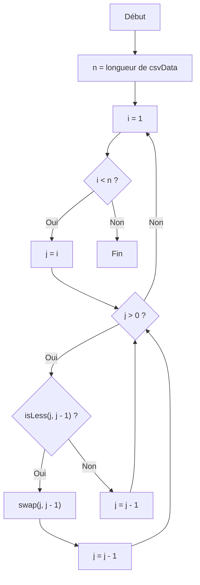
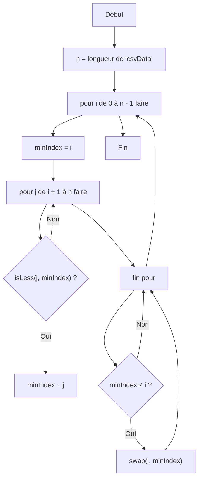
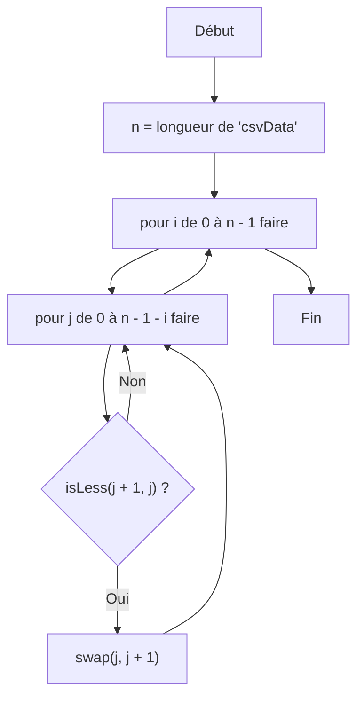
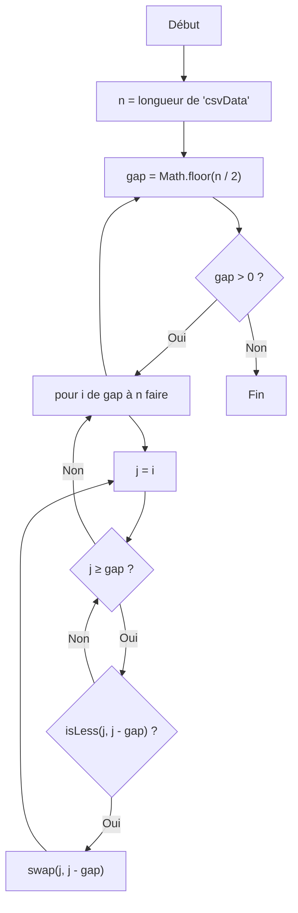
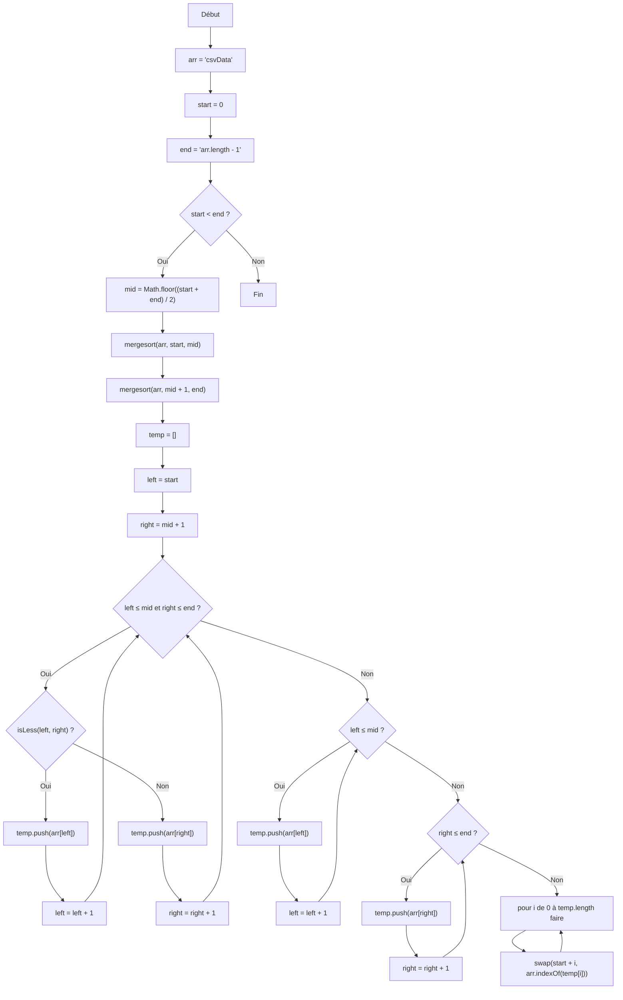
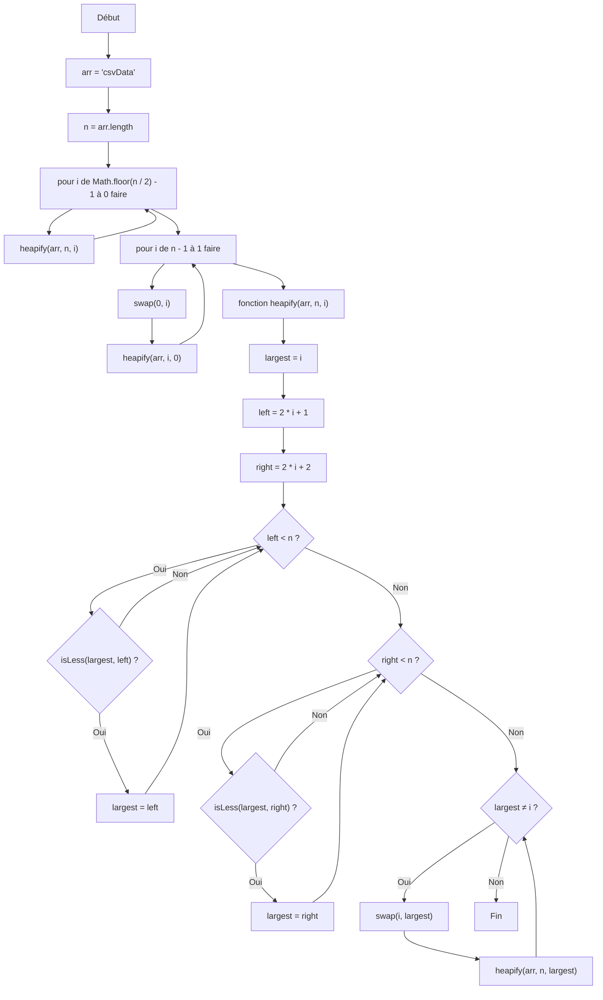
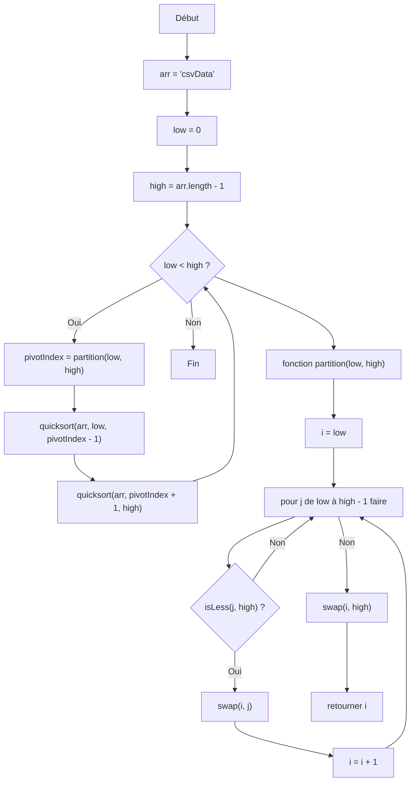
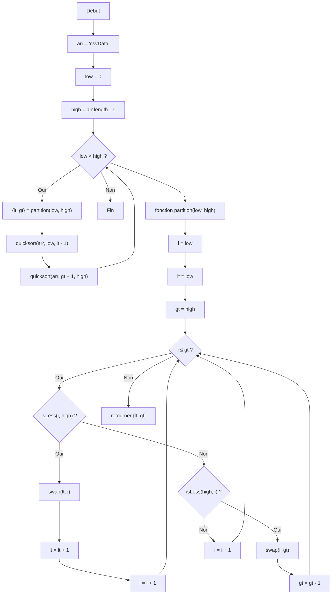

# insertsort
### PSEUDO CODE
```
fonction insertsort() 
    n = "longueur de 'csvData'"

    pour i de 1 à n - 1 faire 
        j = i

        tant que j > 0 et "isLess(j, j - 1)" faire 
            "swap(j, j - 1)"
            j = j - 1
```

### LOGIGRAM


# selectionsort
### PSEUDO CODE
```
fonction selectionsort() 
    n = "longueur de 'csvData'"

    pour i de 0 à n - 1 faire 
        minIndex = i

        pour j de i + 1 à n faire 
            si "isLess(j, minIndex)" alors 
                minIndex = j
            fin si
        fin pour

        si minIndex ≠ i alors 
            "swap(i, minIndex)"
        fin si
    fin pour
```

### LOGIGRAM


# bubblesort
### PSEUDO CODE
```
fonction bubblesort() 
    n = "longueur de 'csvData'"

    pour i de 0 à n - 1 faire 
        pour j de 0 à n - 1 - i faire 
            si "isLess(j + 1, j)" alors 
                "swap(j, j + 1)"
            fin si
        fin pour
    fin pour
```

### LOGIGRAM


# shellsort
### PSEUDO CODE
```
fonction shellsort() 
    n = "longueur de 'csvData'"
    gap = "Math.floor(n / 2)"

    tant que gap > 0 faire 
        pour i de gap à n faire 
            j = i

            tant que j ≥ gap et "isLess(j, j - gap)" faire 
                "swap(j, j - gap)"
                j = j - gap
            fin tant que
        fin pour
        gap = "Math.floor(gap / 2)"
    fin tant que
```

### LOGIGRAM


# mergesort
### PSEUDO CODE
```
fonction mergesort(arr = 'csvData', start = 0, end = 'arr.length - 1') 
    si start < end alors 
        mid = "Math.floor((start + end) / 2)"

        mergesort(arr, start, mid)
        mergesort(arr, mid + 1, end)

        temp = [] 
        left = start 
        right = mid + 1 

        tant que left ≤ mid et right ≤ end faire 
            si "isLess(left, right)" alors 
                "temp.push(arr[left])"
                left = left + 1
            sinon 
                "temp.push(arr[right])"
                right = right + 1
            fin si
        fin tant que

        tant que left ≤ mid faire 
            "temp.push(arr[left])"
            left = left + 1
        fin tant que

        tant que right ≤ end faire 
            "temp.push(arr[right])"
            right = right + 1
        fin tant que

        pour i de 0 à temp.length faire 
            "swap(start + i, arr.indexOf(temp[i]))"
        fin pour
    fin si
```

### LOGIGRAM


# heapsort
### PSEUDO CODE
```
fonction heapsort(arr = 'csvData') 
    n = "arr.length"

    pour i de "Math.floor(n / 2) - 1" à 0 faire 
        heapify(arr, n, i)

    pour i de n - 1 à 1 faire 
        "swap(0, i)"
        heapify(arr, i, 0)

    fonction heapify(arr, n, i) 
        largest = i
        left = "2 * i + 1"
        right = "2 * i + 2"

        si left < n et "isLess(largest, left)" alors 
            largest = left
        fin si

        si right < n et "isLess(largest, right)" alors 
            largest = right
        fin si

        si largest ≠ i alors 
            "swap(i, largest)"
            heapify(arr, n, largest)
        fin si
```

### LOGIGRAM


# quicksort
### PSEUDO CODE
```
fonction quicksort(arr = 'csvData', low = 0, high = 'arr.length - 1') 
    si low < high alors 
        pivotIndex = partition(low, high)
        quicksort(arr, low, pivotIndex - 1)
        quicksort(arr, pivotIndex + 1, high)
    fin si

    fonction partition(low, high) 
        i = low

        pour j de low à high - 1 faire 
            si "isLess(j, high)" alors 
                "swap(i, j)"
                i = i + 1
            fin si
        fin pour
        
        "swap(i, high)"
        retourner i
```

### LOGIGRAM


# quick3sort
### PSEUDO CODE
```
fonction quick3sort(arr = 'csvData', low = 0, high = 'arr.length - 1') 
    si low < high alors 
        {lt, gt} = partition(low, high)
        quick3sort(arr, low, lt - 1)
        quick3sort(arr, gt + 1, high)
    fin si

    fonction partition(low, high) 
        i = low
        lt = low
        gt = high

        tant que i ≤ gt faire 
            si "isLess(i, high)" alors 
                "swap(lt, i)"
                lt = lt + 1
                i = i + 1
            sinon si "isLess(high, i)" alors 
                "swap(i, gt)"
                gt = gt - 1
            sinon 
                i = i + 1
            fin si
        fin tant que
        retourner {lt, gt}
```

### LOGIGRAM
